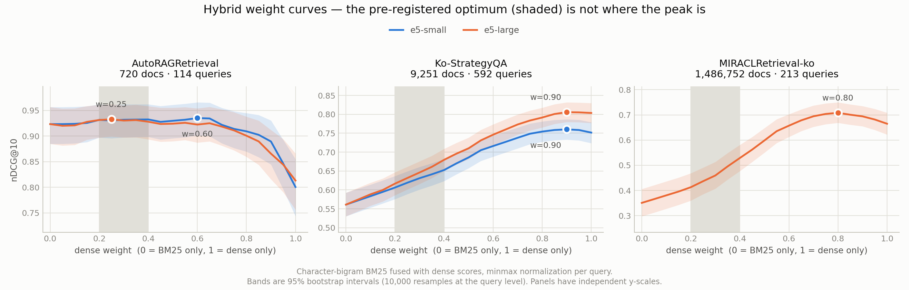

# Week 3 — a sharper test, hubness, and MIRACL

Measured 2026-08-12. Raw records: [`results/week3.jsonl`](../results/week3.jsonl) and
[`results/hybrid.jsonl`](../results/hybrid.jsonl).

Everything on this page was specified in [`PREREGISTRATION.md`](../PREREGISTRATION.md)
section 4b, which was committed and pushed **before any of these measurements ran** —
`git log` puts that commit between the week-2 results and this one. That ordering is the
point: week 2 noted that a paired test would be more sensitive than the one used, and
adding a more sensitive test *after* seeing which comparisons failed to separate is
exactly the move this repository exists to avoid.

## The sharper test does not rescue the prediction

Week 2 judged two weights distinguishable only if their marginal bootstrap intervals
failed to overlap. That is conservative, because every weight is scored on the same
queries. The paired version bootstraps the per-query *difference*, with a Bonferroni
correction for the 20 comparisons each curve makes against its own best weight.

It is indeed more sensitive — the set of weights that cannot be told apart from the best
shrinks everywhere:

| Dataset | Model | Best w | Week 2 (marginal) | Week 3 (paired, Bonferroni) |
|---|---|---|---|---|
| AutoRAGRetrieval | e5-small | 0.60 | 0.00–0.90 (19 of 21) | 0.00–0.70 (15 of 21) |
| AutoRAGRetrieval | e5-large | 0.25 | 0.00–0.90 (19 of 21) | 0.00–0.85 (18 of 21) |
| Ko-StrategyQA | e5-small | 0.90 | 0.55–1.00 (10 of 21) | 0.75–1.00 (6 of 21) |
| Ko-StrategyQA | e5-large | 0.90 | 0.65–1.00 (8 of 21) | 0.85–1.00 (4 of 21) |

**No verdict changes.** H2 is still rejected on Ko-StrategyQA — the pre-registered
0.2–0.4 band sits outside the indistinguishable set by a wider margin than before — and
the optimum on AutoRAGRetrieval still cannot be located.

One thing the sharper test makes clearer: on AutoRAGRetrieval, **w = 0 remains
indistinguishable from the best hybrid** under the more powerful test. Adding dense
signal to character-bigram BM25 buys nothing measurable on that dataset, for either
model.

### The pre-registered resample count was too small, and it shows

Bonferroni at α = 0.05/20 puts the interval endpoints at the 0.125th and 99.875th
percentiles. With the pre-registered B = 10,000 that is **12 resamples in each tail** —
too few to place the endpoint reliably. Re-running at B = 100,000 was added as a
Monte-Carlo precision check (not pre-registered, and it tests the same quantity rather
than a different one):

| Dataset | Model | B = 10,000 (registered) | B = 100,000 |
|---|---|---|---|
| Ko-StrategyQA | e5-small | 0.75–1.00 | **0.80–1.00** |
| all other conditions | | agree | agree |

One boundary weight moves. No verdict depends on it. The registered value is what the
tables above report; the disagreement is recorded rather than quietly resolved in favour
of the larger run. **A future pre-registration should set B from the corrected α, not
from habit.**

## H4 — hubness is real, and the sparse method has it worse

Counting only appearances in the top 10 of queries the document is *not* relevant to,
against a uniform-random null of 1,000 replicates:

| Dataset | Method | Skewness | Null p99 | Exceeds | Gini | Max | Top 1% share |
|---|---|---|---|---|---|---|---|
| AutoRAGRetrieval | BM25 char-bigram | 4.08 | 1.08 | yes | 0.630 | 26 | 9.3% |
| AutoRAGRetrieval | e5-small | 1.58 | 1.08 | yes | 0.583 | 11 | 5.5% |
| AutoRAGRetrieval | e5-large | 1.57 | 1.08 | yes | 0.592 | 11 | 5.2% |
| Ko-StrategyQA | BM25 char-bigram | **63.30** | 1.34 | yes | 0.793 | **334** | **24.2%** |
| Ko-StrategyQA | e5-small | 4.31 | 1.34 | yes | 0.745 | 21 | 10.4% |
| Ko-StrategyQA | e5-large | 8.21 | 1.34 | yes | 0.736 | 38 | 10.4% |

**H4 is supported.** Dense retrieval's skewness exceeds the null 99th percentile on both
datasets, for both models.

**But the framing behind it does not survive.** The private observation that motivated
H4 was about a dense model returning the same passage for unrelated questions. On public
data, character-bigram BM25 does that far more: on Ko-StrategyQA its skewness is 63.3
against dense's 4.3–8.2, one document appears in the top 10 of **334 of 592 queries it is
not relevant to**, and the top 1% of documents take a quarter of all irrelevant top-10
slots. Hubness is not a dense-specific pathology here; it is worse on the sparse side.

That matters practically, because character-bigram BM25 is the configuration this
repository has been recommending on accuracy grounds since week 1. It wins on nDCG@10 and
it is the more hub-prone of the two.

### What causes it — not established

Two candidate mechanisms were checked on Ko-StrategyQA, and neither explains it:

| Candidate | Correlation with the irrelevant-top-10 count |
|---|---|
| Document length in bigrams | **+0.016** |
| Share of the document's bigrams that appear in ≥10% of queries | **+0.062** |

Long documents are not the cause: the top 50 hubs have the same median length as the
corpus. The "shares surface form with many questions" story fares slightly better — those
14 query-generic bigrams are Korean interrogative endings (`나요`, `무엇`, `어떤`, `었나`),
and the top 50 hubs carry 1.68× the corpus-median share of them — but a correlation of
0.06 explains almost none of the variance. The single worst hub is the Korean page for
*Who's on First?*, whose text is largely question forms, which is suggestive; five
examples are not evidence.

**Cause not established.** Recorded as open rather than attributed to the more appealing
of two weak candidates.

## Figure

<picture>
  <source media="(prefers-color-scheme: dark)" srcset="img/weight-curves-dark.png">
  
</picture>

Regenerate with `python scripts/plot_weight_curves.py`. The shaded band is the
pre-registered 0.2–0.4 prediction; the marked point is each curve's measured optimum.

## H5 — supported, including the mechanism it named

H5 was registered before MIRACL-ko had been retrieved from at all: the hybrid optimum
would sit at a dense weight of **≥ 0.5**, and `multilingual-e5-large` alone would beat
character-bigram BM25 alone. Both hold.

| | Measured | Predicted | |
|---|---|---|---|
| Best dense weight | **0.80** (min-max), 0.90 (z-score) | ≥ 0.5 | holds |
| Dense alone | **0.66486** [0.6219, 0.7086] | > BM25 | holds |
| BM25 char-bigram alone | 0.35067 [0.2975, 0.4058] | | intervals do not overlap |

The paired Bonferroni test puts the indistinguishable set at 0.70–0.95 (min-max), so the
0.2–0.4 band is excluded here too — the same verdict as Ko-StrategyQA, now on a corpus
2,000× larger.

H5 also named a *mechanism*, which matters more than the verdict: if document length and
truncation are what separate the datasets, MIRACL-ko should behave like Ko-StrategyQA
rather than like AutoRAGRetrieval. It does.

| Dataset | Mean doc length | Over the 512-token limit | Best dense weight | Winner alone |
|---|---|---|---|---|
| AutoRAGRetrieval | 824 chars | **36.8%** | not locatable | BM25 |
| Ko-StrategyQA | 320 chars | 1.5% | 0.90 | dense |
| MIRACL-ko | 175 chars | not measured | 0.80 | dense |

The one dataset where BM25 wins and the weight curve is flat is the one whose documents
the encoders truncate. That was stated in advance as the reason, and the prediction
derived from it came out right.

## A third exact dense reproduction

| Dataset | Measured | KURE published | Difference |
|---|---|---|---|
| AutoRAGRetrieval | 0.81337 | 0.81337 | 0.00000 |
| Ko-StrategyQA | 0.80348 | 0.80348 | 0.00000 |
| MIRACL-ko | **0.66486** | **0.66486** | **0.00000** |

Five published numbers from two independent sources are now reproduced in this harness —
two BM25, three dense — across corpora from 720 to 1,486,752 documents. The exactly-zero
differences are addressed against the pre-registered suspicion rule in
[`results-week2.md`](results-week2.md); MTEB was never installed here and the metrics are
independently implemented.

## Character bigrams beat the published baseline on every dataset

| Dataset | Published MTEB BM25 | Character bigram | Gain |
|---|---|---|---|
| AutoRAGRetrieval | 0.65022 | 0.92345 | +0.273 |
| Ko-StrategyQA | 0.37808 | 0.56108 | +0.183 |
| MIRACL-ko | 0.24521 | 0.35067 | +0.105 |

No BM25 parameter was tuned in any of these. The margin shrinks as the corpus grows, but
it does not close.

## Hubness on MIRACL-ko, and where the statistic stops working

| Method | Skewness | Null p99 | Exceeds | Max | Documents ever retrieved |
|---|---|---|---|---|---|
| BM25 char-bigram | 181.43 | 26.55 | yes | 25 | 1,471 of 1,486,752 |
| e5-large | 34.20 | 26.55 | yes | 4 | 1,662 of 1,486,752 |

Same direction as the smaller datasets: both exceed the null, and BM25 far more so.

**The magnitude statistics are degenerate at this scale and should not be read.** With
213 queries there are only 2,130 top-10 slots for 1.49 million documents, so 99.9% of the
corpus has a count of zero. The Gini coefficient is 0.999 for both methods and the "top
1% share" is 1.000 for both — the top 1% is 14,867 documents, which already contains every
document that was retrieved even once. Those columns are omitted above for that reason.
The skewness-versus-null comparison survives, because the null is computed at the same
corpus size and lands at 26.55 rather than the ~1.1–1.3 seen on the small sets.

## Cost, measured

| | |
|---|---|
| Corpus load | 8.7 s, 2.0 GB RSS |
| Character-bigram tokenization | 34.8 s, 205,213,744 tokens |
| BM25 index + full score matrix | 143 s |
| Dense encoding, e5-large, 1,486,752 documents | **58 min** |
| Peak RSS for the whole run | ~12 GB |

Pooling the bigram strings was necessary: 258M separate two-character objects cost about
20 GB, one shared object per distinct bigram costs about 2 GB. Token values are identical,
and the week-1 and week-2 numbers were re-run to confirm they did not move.

## Where this leaves the original claim

Across three public datasets:

- **BM25 with a good tokenizer is much stronger than the published baselines suggest**, on
  every dataset, by 0.105 to 0.273 nDCG@10.
- **A small multilingual dense model can lose to it** — but only on the corpus whose
  documents that model truncates.
- **The hybrid weight finding does not generalize.** It was predicted at 0.2–0.4 with
  accuracy falling above that. Measured: 0.90, 0.90 and 0.80 on the three datasets where
  an optimum can be located at all, with accuracy *rising* almost to pure dense.
- **Hubness is real but is not a dense-specific pathology.** The sparse method has it
  worse on all three datasets.

The private measurement that started this looks corpus-specific: it was made on long
internal documents, which is the regime where these results agree with it, and it does not
describe Korean retrieval in general.
